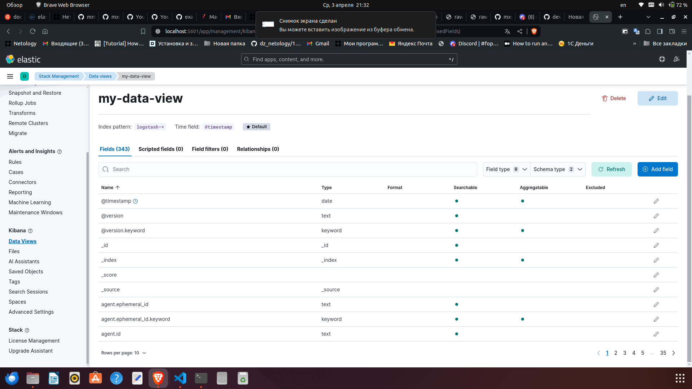

# Никоноров Денис - FOPS-8

# Домашнее задание к занятию 15 «Система сбора логов Elastic Stack»

## Задание повышенной сложности

Не используйте директорию [help](./help) при выполнении домашнего задания.

## Задание 1

Вам необходимо поднять в докере и связать между собой:

- elasticsearch (hot и warm ноды);
- logstash;
- kibana;
- filebeat.

Logstash следует сконфигурировать для приёма по tcp json-сообщений.

Filebeat следует сконфигурировать для отправки логов docker вашей системы в logstash.

В директории [docker](/docker/) создан манифест docker-compose и конфигурации filebeat/logstash для выполнения этого задания. 

Также создан python код [py](/docker/py/pylogtest.py)

Этот код Python выполняет следующие действия в бесконечном цикле:

1. Генерирует случайное число от 0 до 3.
2. В зависимости от сгенерированного числа, записывает различные сообщения в журнал:
   - Если число равно 0, записывает информационное сообщение "Hi guys, this is a debug message".
   - Если число равно 1, записывает предупреждающее сообщение "Guys, this is a warning message".
   - Если число равно 2, записывает сообщение об ошибке "Guys, this is an error message. PROD FELL".
   - Если число равно 3, записывает сообщение об исключении "this is an exception message".
3. Затем код ожидает 1 секунду перед следующей итерацией цикла.

Результатом выполнения задания должны быть:

- скриншот `docker ps` через 5 минут после старта всех контейнеров (их должно быть 5);
- скриншот интерфейса kibana;
- docker-compose манифест (если вы не использовали директорию help);
- ваши yml-конфигурации для стека (если вы не использовали директорию help).

## Задание 2

Перейдите в меню [создания index-patterns  в kibana](http://localhost:5601/app/management/kibana/indexPatterns/create) и создайте несколько index-patterns из имеющихся.

Перейдите в меню просмотра логов в kibana (Discover) и самостоятельно изучите, как отображаются логи и как производить поиск по логам.

Тут видно как [py](/docker/py/pylogtest.py) генерит сообщения
